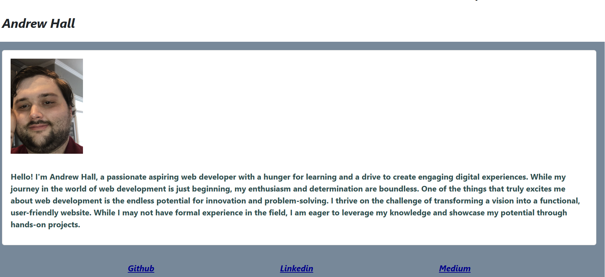

# My React Portfolio

## Description

This is a single page react portfolio showcasing some of the projects I have worked on and some contact information.

#### [Vist the page here](https://andrewchall92.github.io/my-portfolio/)

## Features

- Navigation links for ease of use.
- Links to my deployed webpages.
- Contact information.
- Adaptive viewport.

Technology Used         | Resource URL           | 
| ------------- |:-------------:| 
| HTML    | [https://developer.mozilla.org/en-US/docs/Web/HTML](https://developer.mozilla.org/en-US/docs/Web/HTML) | 
| CSS     | [https://developer.mozilla.org/en-US/docs/Web/CSS](https://developer.mozilla.org/en-US/docs/Web/CSS)      |   
| Git | [https://git-scm.com/](https://git-scm.com/)     |
| JavaScript | [https://developer.mozilla.org/en-US/docs/Web/javascript](https://developer.mozilla.org/en-US/docs/Web/javascript)  |
| Node.js | [https://nodejs.org/en](https://nodejs.org/en) |
| React | [https://developer.mozilla.org/en-US/docs/Learn/Tools_and_testing/Client-side_JavaScript_frameworks/React_getting_started](https://developer.mozilla.org/en-US/docs/Learn/Tools_and_testing/Client-side_JavaScript_frameworks/React_getting_started) |

## License

This project is licensed under the [MIT License](LICENSE).